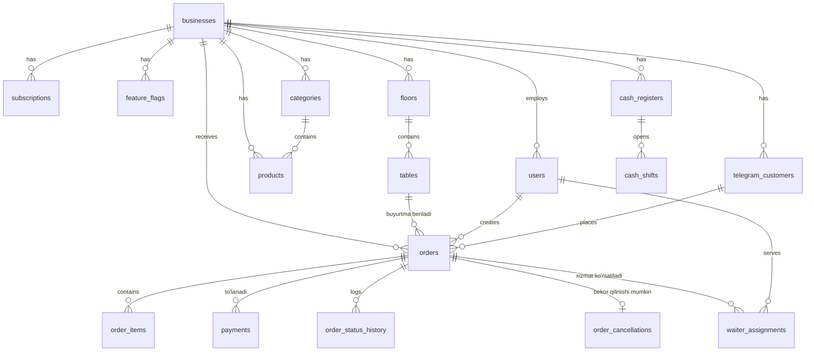

# Arxitektura

## Ma'lumotlar bazasi bog'lanishi (ER diagram)



## Buyurtma hayot sikli (order lifecycle)

```
QR orqali:     new → activated (kassir tasdiqlaydi) → paid
Kassir/ofitsiant: activated (to'g'ridan-to'g'ri) → paid
Online (Telegram): new → activated → paid
Har qanday holatda: → cancelled (sabab bilan)
```

## Real-time oqim

1. Mijoz QR yoki Telegram orqali buyurtma beradi
2. Backend `orders` jadvaliga yozadi va Redis'ga `orders:{business_id}` kanaliga signal yuboradi
3. Frontend (kassa paneli) WebSocket orqali shu kanalga ulangan va signalni oladi
4. Kassa panelida ovozli/vizual bildirishnoma chiqadi

## Multi-tenant izolyatsiya

Har bir jadvalda `business_id` (yoki unga bog'liq tashqi kalit) mavjud.
Har bir API so'rovda JWT token ichidan `business_id` olinadi va barcha
SQL so'rovlar shu ID bilan filtrlanadi — bu bitta kafe boshqa kafening
ma'lumotini ko'ra olmasligini kafolatlaydi.

## Obuna turlari va feature flag mantiqi

| Obuna | qr_menu | online_order | telegram_bot |
|---|---|---|---|
| basic (1) | ❌ | ❌ | ❌ |
| qr (2) | ✅ | ❌ | ❌ |
| full (3) | ✅ | ✅ | ✅ |

`feature_flags` jadvali orqali super-admin har bir kafe uchun bu
funksiyalarni qo'lda yoqadi/o'chiradi (hozircha obuna to'lovi qo'lda
kiritilgani uchun).

## Login oqimi ("Server" tushunchasi)

Foydalanuvchi 3 ta maydonni kiritadi:
1. **Server** (`business_code`) — qaysi kafe/restoran ekanini bildiradi
2. **Login**
3. **Parol**

Backend avval `business_code` orqali kafeni topadi, so'ng shu kafe
ichidan login/parolni tekshiradi. Bu bir xil login turli kafelarda
qayta ishlatilishiga imkon beradi.
